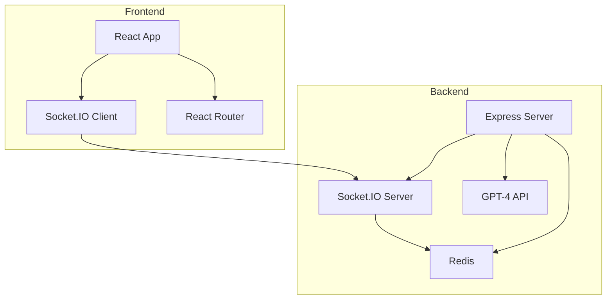
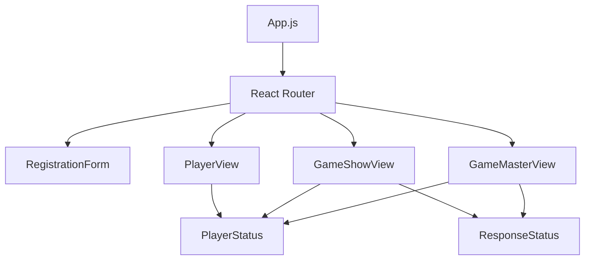
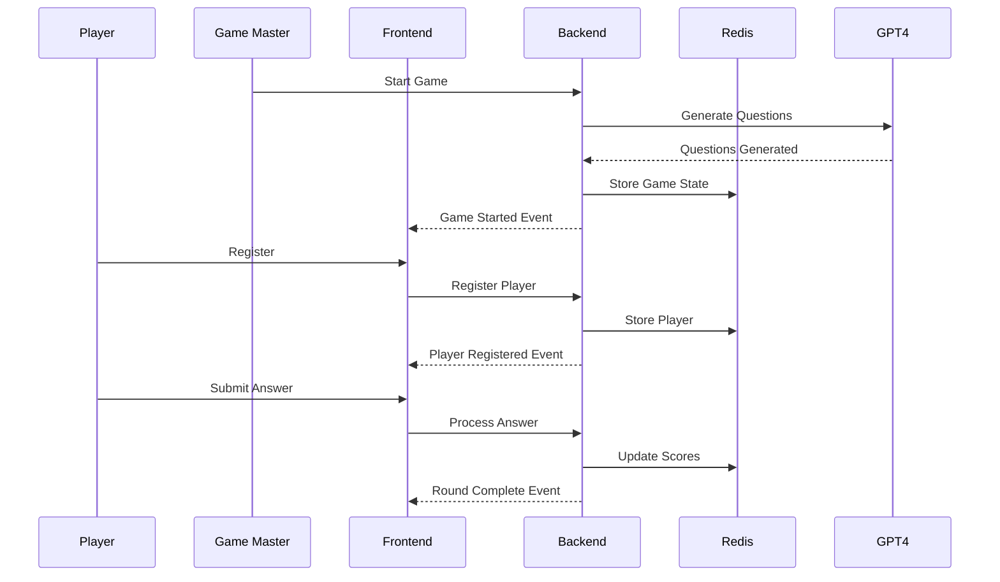
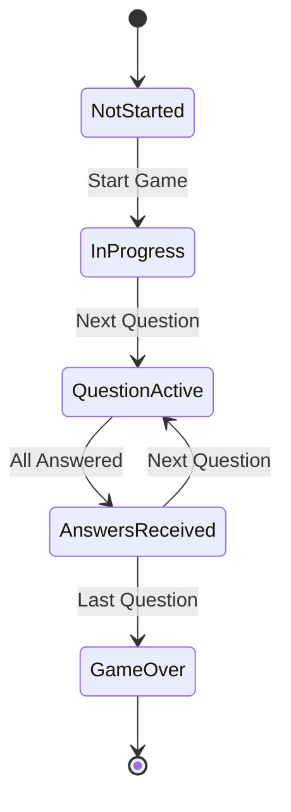
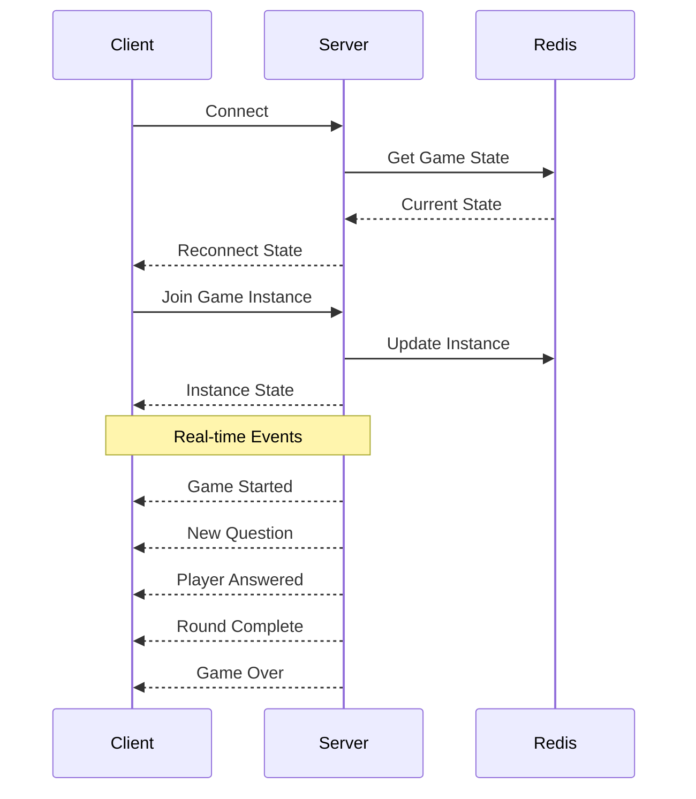
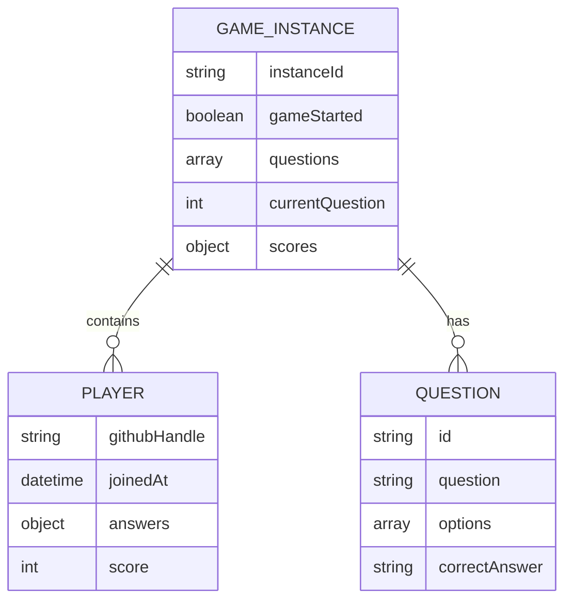
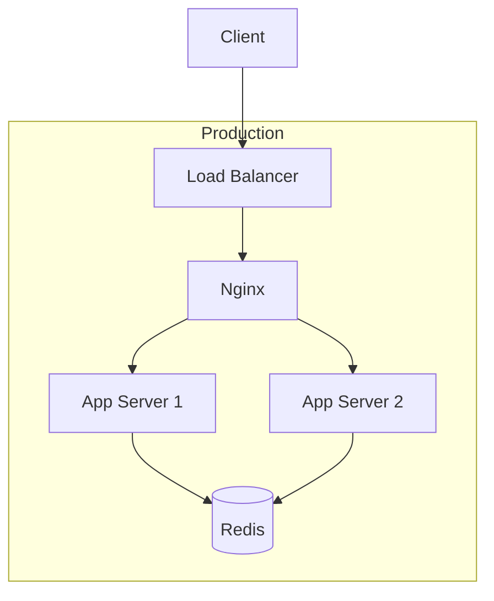
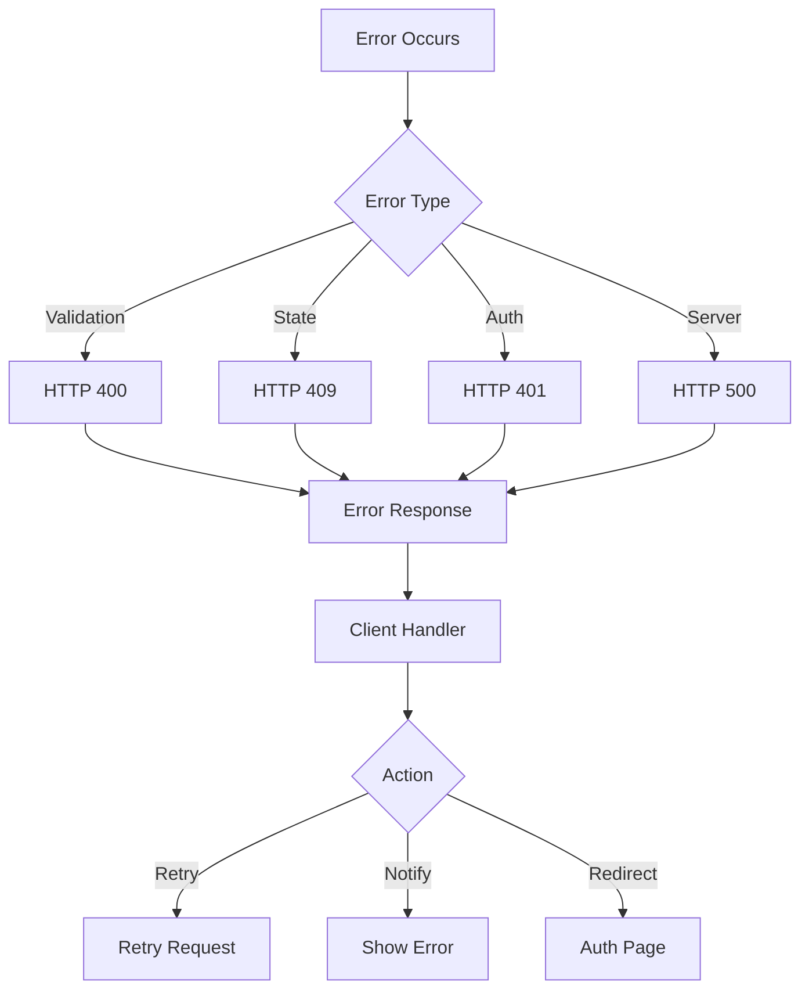

# Architecture Documentation

## System Architecture

## Component Hierarchy

## Data Flow

## State Management

## WebSocket Communication

## Redis Data Model

## Deployment Architecture

## Error Handling Flow

