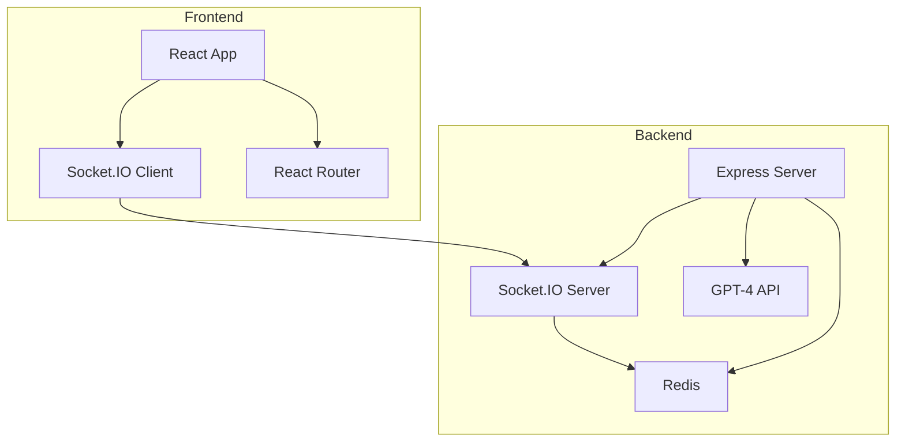

# Quiz Game 🎮

A multiplayer quiz game with a retro 70's game show aesthetic, powered by GPT-4. Features dynamic question generation, real-time multiplayer support, and a virtual host (Mona Woolery) that provides witty commentary.

## System Architecture



## ✨ Features

- 🤖 GPT-4 powered question generation across various topics
- 🎮 Real-time multiplayer gameplay using Socket.IO
- 🎭 GitHub-based player registration with avatar integration
- 🎙️ Virtual host (Mona Woolery) providing dynamic commentary
- 📊 Live score tracking and leaderboard
- 🎯 Configurable game settings (number of questions, topics)
- 💾 Persistent game state with Redis
- 🏆 Round-by-round winner celebrations
- 🎪 Multiple game instances support
- 🔄 Automatic reconnection handling

## 🛠️ Tech Stack

- **Frontend**: React, Socket.IO Client, React Router
- **Backend**: Express.js, Socket.IO, Redis
- **AI Integration**: OpenAI GPT-4 API
- **Authentication**: GitHub API
- **State Management**: Redis
- **Build Tools**: Node.js, npm
- **Testing**: Jest, Testing Library
- **Deployment**: Docker, Docker Compose

## 📚 Documentation

- [API Documentation](backend/API.md)
- [Component Documentation](frontend/COMPONENTS.md)
- [Contributing Guidelines](CONTRIBUTING.md)
- [Deployment Guide](DEPLOYMENT.md)
- [Architecture Documentation](ARCHITECTURE.md)

## 🚀 Quick Start

### Prerequisites

- Node.js 16+
- Redis server
- OpenAI API key
- GitHub API access

### Installation

1. Clone the repository:
   ```bash
   git clone https://github.com/cheeragpatel/quiz-game.git
   cd quiz-game
   ```

2. Run the setup script:
   ```bash
   npm run setup
   ```

3. Configure environment:
   ```bash
   # Update .env with your keys
   OPENAI_API_KEY=your_key_here
   GITHUB_CLIENT_ID=your_client_id
   GITHUB_CLIENT_SECRET=your_client_secret
   REDIS_URL=redis://localhost:6379
   ```

4. Start development servers:
   ```bash
   npm run dev
   ```

### Docker Setup

1. Build and start containers:
   ```bash
   docker-compose up --build
   ```

2. Access the application:
   - Frontend: http://localhost:3000
   - Backend API: http://localhost:3001

## 🎮 Game Roles

### Game Master
- Access at `/game-master`
- Configure game settings
- Control game flow
- Monitor player progress

### Players
- Register at root URL
- Join using GitHub handle
- Answer questions
- View scores and rankings

### Spectators
- View at `/game-show`
- Watch live gameplay
- See leaderboard
- Enjoy host commentary

## 🎨 Customization

### Game Settings
- Question count (5-50)
- Topic selection
- Time limits
- Scoring rules

### Display Options
- Theme customization
- Font preferences
- Animation settings
- Layout options

## 🧪 Testing

Run the test suite:
```bash
# All tests
npm test

# Backend tests
npm run backend:test

# Frontend tests
npm run frontend:test
```

## 📦 Production Deployment

See [DEPLOYMENT.md](DEPLOYMENT.md) for detailed instructions on:
- Server setup
- SSL configuration
- Environment variables
- Monitoring
- Backup procedures

## 🤝 Contributing

We welcome contributions! Please see [CONTRIBUTING.md](CONTRIBUTING.md) for guidelines.

## 📄 License

This project is licensed under the ISC License.

